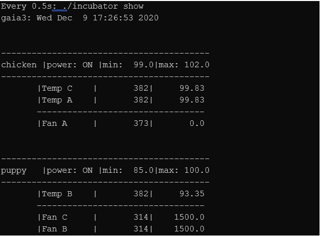
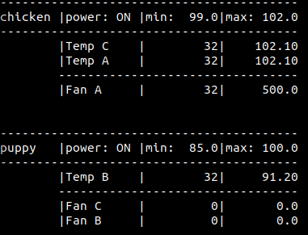
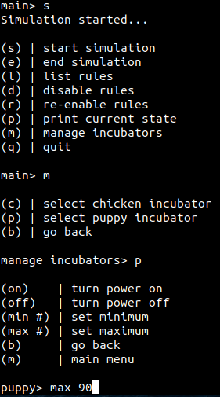
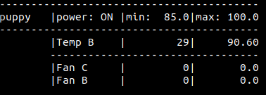

---

**NOTE**

The information contained in this document represents information about preview features of the product. Features might change when the product is released for general availability.

---

# Gaia incubator example

---

The following example models an incubator system for chickens and puppies. It simulates temperature sensors and cooling fans.

The simulation has two distinct components: A simulator component that models the environment and a Gaia component that controls the incubators' behavior in response to changes.

As the simulation runs, you will notice that the temperature in both incubators tends to increase. To counteract the environment getting too hot for the young animals, the Gaia component invokes logic to turn on the fans.

## Prerequisites

For information about the Gaia Platform prerequisites and installing the SDK, see [Getting Started with the Gaia Platform](../getting-started-with-gaia.md).

### Preparing the demo

1.  To copy the incubator demo into your current directory:
    
    ```cp -r /opt/gaia/examples/incubator/ .```

2.  Navigate to the incubator demo folder:

  ```cd incubator```

3.  If the Gaia database server is not running, start it now. To start the server on a machine that supports systemd:

      **sudo systemctl start gaia**

4.  Complete setup of the build environment by issuing the following commands:

    ```
    mkdir build\
    cd build\
    cmake ..\
    make
    ```
## The incubator demo

The example includes the following files:

-   CMakeLists.txt - Build instructions for setting up the necessary files for the example.
-   gaia.conf - Configuration settings for the database and rules engine that comprise the Gaia Platform.
-   gaia_log.conf - configuration settings for the platform and  application loggers that the Gaia Platform uses.
-   incubator.ddl - Describes the schema to create the database.
-   incubator.ruleset - Defines the rules definitions for the example.
-   Main.cpp - The incubator application that drives the simulation.
-   README.md - Information about the example and troubleshooting instructions.

Running the demo is the next thing to do to see what it does, then we can explain how it works.

### Running the incubator

It is helpful to Have a couple of terminal windows running to see what happens 'in real time.'

First, open two terminal windows. You will run the demo in one and monitor it in the other.

In your first terminal window, run the command:

```./incubator sim```

When the demo starts, it displays the following menu:


To start the simulation, select **b**.

In the second terminal window, run the command:

```watch -n .5 ./incubator show```

This command dumps the contents of the incubators' state and their sensors and fans to the screen. The output will appear similar to the following:



The output shows the incubator and components being monitored. For each of the temperature sensors and fan actuators, the output displays a timestamp in the second column and the current temperature or fan actuator speed in the third column.

As the simulation runs, the temperature in both incubators tends to increase. To counteract the environment getting too hot for your chickens and puppies, Gaia invokes logic to turn on the fan actuators. Let's look at how this is accomplished.

### How the incubator demo works

The core Gaia files that you need to examine are the incubator.ddl and incubator.ruleset files.

First, let\'s examine the data store.

The schema is located in the incubator.ddl and it defines three tables.

-   incubator - Models the incubator.
-   actuator - Models the fans.
-   sensor - Models the temperature sensor.

The schema also defines two [relationships](/reference/ddl-relationships.md):

- incubator_sensors - Defines a one-to-many relationship between the incubator table and the sensor table.
- incubator_actuators - Defines a one-to-many relationship between the incubator table and the actuator table.

In Gaia the fields defined in the data definition file are considered potentially Active. This means that the Gaia Rules engine executes Rules when you refer to the field in the Rule. 

You have two ways to specify which fields are active:

-   Use the `on_update()`or `on_change()` attribute to list the active fields in the Rules.
    OnUpdate(field1, field2, field3)
-   Prepend an @ sign to the fields that are Active.
    @field1 = ...

The incubator.ruleset file defines the logic that acts on the Active Fields.

This file contains several Gaia rules in the Ruleset. The second Rule is defined as follows:

```c++
    // Rule 1:  Keep the temperature in range of the incubator limits.
    on_update(sensor.value)
    {
        if (!incubator.is_on)
        {
            return;
        }

        if (sensor.value < incubator.min_temp 
            || sensor.value > incubator.max_temp)
        {
            for (A:actuator)
            {
                A.value = adjust_temperature(incubator.min_temp, incubator.max_temp, sensor.value, A.value);
                A.timestamp = g_timestamp;
            }
        }
    }
```

The Rule uses the `on_update()` attribute to watch for changes sensor.value field.

If the temperature is outside of the acceptable range it calls adjust_temperature to set a new actuator value. 



The Rule fires whenever the temperature value changes, which means that the fan actuator might increase its speed several times. It can even increase fast enough to drive the temperature of the incubator below the specified minimum value. But this is okay. The *else if* block in the Ruleset contains the necessary logic to reduce the fan actuator speed if it falls below the minimum temperature.

Additionally, since the Gaia Platform understands your schema and how your tables are related, the Rule is reading all the sensors' values in each incubator and setting the value for all the actuators in each incubator. In this example, each incubator is related to a set of sensors and actuators.

So far, we've focused on changes to the sensor.value field. But we also have an incubator.max_temp or incubator.min_temp field. What if we wanted to change the temperature range of our incubator? Would Gaia be able to respond to this as well? The answer is yes. In this example, sensor.value, incubator.max_temp, and incubator.min_temp are all Active Fields.

```c++
    // Rule 1:  Verify the temperature is kept in range if the
    // incubator temperature limits change. 
    on_update(incubator.max_temp, incubator.min_temp)
    on_update(incubator.max_temp, incubator.min_temp)
    {
        if (!incubator.is_on)
        {
            return;
        }

        sensor_loop:
        for (S:sensor)
        {
            if (S.value < min_temp 
                || S.value > max_temp)
            {
                for (A:actuator)
                {
                    A.value = adjust_temperature(min_temp, max_temp, S.value, A.value);
                    A.timestamp = g_timestamp;
                }
                break sensor_loop;
            }
        }
    
```

In Rule 1 the for loop iterates over all the sensors in the incubator. The second *if block* tells Gaia to check whether th min_temp and max_temp fields in the incubator table are outside of the new values. If they are, we adjust the fan actuator values. We do this by assigning a new value to the actuator table, as seen in the if block's body.

The simulation environment lets us test the link between the Active Fields in the Ruleset. For this example, you will manage one of the incubators, setting the temperature range to a new value.

To set the new value:

1.  Start the simulation.
2.  To manage the incubators, select **m**.
3.  To manage the puppies incubator, select **p**.
4.  To drive the execution of the Rule described above, set the new max_temp value to one that is less than the current sensor value. For example, if the puppy incubator temperature is reading 92, set  the max_temp value to 90.

Now, when you monitor the incubators, you will see that Gaia increments the fan actuator values when the temperature exceeds the new maximum temperature.



Before submitting the new max_temp, your tables should look like this.



After you submit the new max value, both fan actuators associated with the incubator immediately start increasing their speed, like so:


This application of the Rule functions on the same principle as in the first example. The difference is that the change that triggers the Rule is caused by our intervention rather than the changes driven by the environment.

In the first example, changes in sensor.value caused the Rule to fire and to compare the updated sensor.value against the current value of max_temp. In this example, you changed the value of max_temp which caused the Rule to fire and compare the current value sensor.value against the updated value of max_temp.

It is also worth observing that in this case, more than one fan actuator was associated with the incubator and both fan actuators had their speeds increased. The way that we have defined our Gaia data tables means actuators refer back to the incubator. Gaia is aware of this connection and can apply fan actuator increase logic to all the actuators associated with the puppies incubator.

There is one more concept to review. So far, we have explored changes that come either from the ambient environment or direct user intervention. But a compelling design concept for writing programs in Gaia is the idea of "forward chaining." This is when the firing of one Rule can result in a change to state that immediately triggers the firing of a subsequent Rule.

Rule 4 in the Ruleset file illustrates this functionality:

```c++
    // Rule 4:  If the fan is at 70% of its limit and the temperature is still too hot then
    // set the fan to its maximum speed.
    on_update(actuator.value)
    {
        if (actuator.value == c_fan_speed_limit)
        {
            return;
        }

        if_loop:
        if (S:sensor.value > incubator.max_temp)
        {
            if (actuator.value > c_fan_threshold * c_fan_speed_limit)
            {
                actuator.value = c_fan_speed_limit;
                actuator.timestamp = g_timestamp;
            }
            break if_loop;
        }
    }
```

The comment preceding the Rule describes its purpose. If the fan actuators have been ratcheting up to counteract a hot incubator, there comes a point when we do not want to wait for further incremental increases. Instead, we max out the fan actuator's speed. The first *if block* acts as a simple guard where the second encodes the real logic.

There are several variables in the conditional. The primary active variable is the actuator.value field. This means that changes to the fan actuator speed trigger the Rule. You will also notice two other variables from the prior Rule, sensor.value and incubator.max_temp. However, these fields are not listed in the `on_upate()` attribute and therefore do not cause the Rule to fire.

We can now review how the first Rule and the just-introduced Rule will interact. As you recall, the first Rule is triggered by a change in the sensor.value field and results in the modification of the actuator.value field. This change now immediately causes Gaia to check the conditions described in Rule 3. This is forward chaining in action.

To see this behavior, return to the simulation controller and allow the incubator to heat up considerably beyond its maximum temperature. To do this, after starting the simulation, select manage incubators from the menu, select an incubator and enter the command to turn off the power. This forces the incubator to stop actuating the fans (allowing the environment to heat up).


Wait until the temperature of the incubator exceeds the maximum temperature range by a few degrees. When it does, enter the command to turn the incubator power back on. The associated fan actuator speed values start climbing in increments of 500. When the fan actuator speed reaches 3500, there is a jump to 5000 - a sudden change of 1500. This sudden jump is caused by the firing of Rule 1 modifying the actuator.value (fan actuator speed) which triggers the immediate firing of Rule 3. Use forward chaining to build out complex application behavior.
